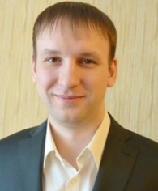

|
 :-:                  |

## DENIS GUSSER
##### CONTACTS:
e-mail: gusser.denis@gmail.com
tel: +7-913-133-3911
---
#### ABOUT ME
---
regularly learn something new, easy to learn, self-organized

#### Skills:

HTML, CSS, PHP, JS, Python, Git, Linux, Docker.

#### Сode examples:

*Python code:*

```python
x = 'Hello, World!'
print(x)
```

*JavaScript code:*

```javascript
alert( 'Hello, world!' );
```

*PHP code:*

```php
<?php
  echo "Hello, World!";
?>
```
---
### WORK EXPERIENCE
---
    2018 — Present
**Судебный эксперт/специалист**
*Center for Independent Expertise and Law / Kemerovo*

Conducting pre-trial and judicial research by type:

- computer-technical expertise (including the study of software operation on Windows, Linux, Android, IOS);
- merchandising expertise (including the study of pre-installed software on Windows, Linux, Android, IOS);
- construction and technical expertise;
- engineering expertise.

Created and administered the website of the center of independent expertise and law: <https://kem-expert.ru>

    2015 — 2021
**Electronic engineer**
*Service center "Device" / Kemerovo*

Repair of digital and household appliances: software, modular, component.

Created and administered the service center website: <https://devicerussia.ru>.

    2012 — 2015
**Сivil engineer**
*Kemerovo DSK / Kemerovo*

    2011
**Economist of the Municipal Property Registry Department**
*Municipal Property Management Committee / Kemerovo*

---
### EDUCATION
---
**Open Academy of Professional Education**, *2021*
Judicial construction and technical and cost expertise of real estate objects,
**Specialty: Builder-expert**

**Plekhanov Russian University of Economics**, *2019*
Commodity research and examination of goods (by application),
**Specialty: Commodity Expert**

**Kuzbass State Technical University**, *2010*
Economics and management at the enterprise (in mechanical engineering),
**Specialty: Engineer-economist**

#### Languages:
Russian - C2, English - A2, German - B1
___